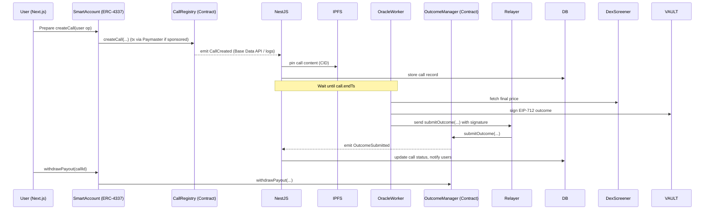
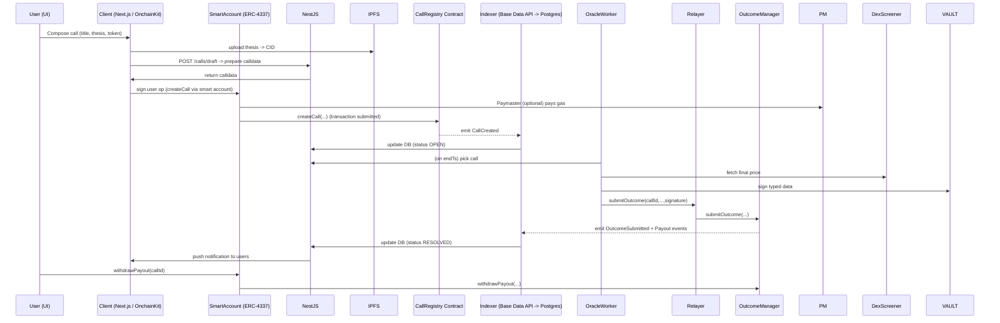

# BackIT (Onchain) - (Base-Aligned, Foundry + OnchainKit)

**Complete system design & architecture (fool-proof, opinionated, ready-to-ship)**  
Stack (final):
- **Frontend:** Next.js (App Router) + **OnchainKit** (provider + UI)  
- **Wallet / Auth:** ERC-4337 Smart Accounts (AA), Passkeys / Embedded wallets, OnchainKit provider (no SIWE)  
- **Backend:** NestJS (Oracle worker, relayer, indexer)  
- **DB:** PostgreSQL + Redis + BullMQ  
- **Chain:** Base (EVM) — use Base RPC (Alchemy/Ankr) + Base Data API for indexed reads  
- **Contracts:** Solidity, develop with **Foundry** (forge, cast, anvil). Keep Hardhat for verification scripts if desired.  
- **Price sources:** DexScreener (primary) + GeckoTerminal (fallback)  
- **Oracle model:** Off-chain EIP-712 signer (scalable; migrate to multisig later)  
- **Gas sponsorship:** Base Paymaster (ERC-4337) for mainnet onboarding

---

## Table of contents

1. Goals & invariants  
2. High-level architecture diagrams  
3. Component responsibilities (detailed)  
4. On-chain design (contracts, events, interfaces)  
5. Oracle & outcome verification (EIP-712 flow — exact schema)  
6. Off-chain backend (NestJS) — services, DB, worker & relayer behavior  
7. Frontend (Next.js + OnchainKit) — flows, AA, passkeys, UX details  
8. Indexing, Base RPC, Base Data API & realtime  
9. Storage & content immutability (IPFS)  
10. Security, reliability & audit checklist  
11. Failure modes & mitigations  
12. Deployments, dev tools & CI/CD (Foundry + Hardhat + Base)  
13. MVP roadmap & timelines  
14. Appendices: DB schema, API list, EIP-712 schema, contract snippets, sequence diagrams

---

# 1 — Goals & invariants

- **Calls are immutable prediction objects**: token, condition, stake, startTs, endTs, contentCID (IPFS). On-chain stores minimal metadata only.  
- **Support for any token (including memecoins)**: DexScreener coverage is required. Pyth or on-chain oracles are optional later but not sufficient for memes.  
- **Stakes**: Prefer ERC-20 stablecoin (USDC) for predictable payouts. Native ETH or other ERC-20 possible. Stakes are escrowed on-chain.  
- **Outcome model**: Backend fetches price data at deadline, constructs an EIP-712 typed message, signs, and submits `submitOutcome` to contract (or returns signature to relayer). Contract verifies signer and settles.  
- **User experience**: Leverage ERC-4337 smart accounts and Base Paymaster to allow gasless onboarding. Use OnchainKit provider for UI integration.  
- **Simplicity & scalability**: Keep on-chain logic minimal, index events off-chain, design oracle pipeline to scale from single signer → multisig → multiple signers.  
- **Security**: Oracle keys stored in KMS/Vault; use multisig (Gnosis Safe) for admin actions in production.

---

# 2 — High-level architecture diagrams

## 2.1 System flow (overview)

```mermaid
flowchart LR
  subgraph Frontend
    U[User]
    A[Next.js + OnchainKit]
    AA[SmartAccount (ERC-4337)]
  end

  subgraph Backend
    N[NestJS API]
    Q[BullMQ / Workers]
    O[OracleWorker (DexScreener)]
    R[Relayer/Paymaster Proxy]
    DB[(Postgres + Redis)]
    IPFS[IPFS Pinning]
    VAULT[KMS / Vault]
    BASEAPI[Base Data API]
  end

  subgraph Chain
    C[CallRegistry]
    M[OutcomeManager]
    PM[Base Paymaster]
    USDC[USDC/ERC20]
  end

  U --> A
  A --> AA
  A --> N
  A --> IPFS
  N --> DB
  N --> Q
  Q --> O
  O --> VAULT
  O --> R
  R --> M
  AA -->|UserOp| PM
  PM --> C
  C --> BASEAPI
  M --> BASEAPI
  BASEAPI --> N
  M --> USDC
  DB --> A
```

## 2.2 Sequence: Create → Resolve → Payout



---

# 3 — Component responsibilities (detailed)

## 3.1 Frontend (Next.js + OnchainKit)
- **Wallet / Auth**: OnchainKit manages smart account creation & user ops; passkeys and embedded wallets supported.  
- **Token discovery**: Proxy calls to backend `/tokens/search` which queries DexScreener and caches results.  
- **Create Call UI**: Title, thesis, token selector, condition builder (Target/Percent/Range), stake selector (USDC default). Upload thesis to IPFS.  
- **Transaction flow**: Compose user op, sign via smart account, submit via OnchainKit. If user opts-in, Paymaster sponsors gas.  
- **Feeds & Threads**: Pull from Postgres via NestJS endpoints; live updates via WebSocket.  
- **Outcome provenance**: Show final price, signer address, EIP-712 signature data and link to evidence (API response pinned to IPFS if required).

## 3.2 Off-chain Backend (NestJS)
- **Auth**: Manage smart-account sessions; map smart account → user profile; no SIWE.  
- **TokenDiscovery**: Normalize token metadata, compute liquidity & safety score.  
- **IndexerService**: Use Base Data API (or WebSocket + RPC) to consume events and update Postgres.  
- **OracleWorker**: Identify due calls, fetch prices, sign outcomes via KMS, submit signed outcome via relayer.  
- **RelayerService**: Submit on-chain txs (submitOutcome) and optionally meta-tx for users. Interact with Paymaster for gas sponsorship.  
- **PinService**: Upload & pin call content and optionally API evidence to IPFS.  
- **NotificationService**: WebSocket server for live feed pushes.  
- **Admin/Moderation**: Flag, review, and manage dispute workflows.

## 3.3 On-chain (Contracts)
- **CallRegistry**: Minimal storage of call records and stakes; emits `CallCreated`.  
- **OutcomeManager**: Verifies EIP-712 signatures and settles outcomes; supports `withdrawPayout`.  
- **Paymaster**: ERC-4337 Paymaster contract for sponsorship.  
- **Treasury/FeeVault**: Collects platform fees for operations.

## 3.4 Indexing & Storage
- **Base Data API**: Used to read events and transaction history quickly.  
- **TheGraph (optional)**: For complex GraphQL queries / analytics if needed.  
- **Postgres**: Main read model for the UI and feeds; use `tsvector` for full text.  
- **IPFS**: Store long texts, avatars, comments. Pin via Pinata or self-hosted cluster.

---

# 4 — On-chain design (contracts, events, interfaces)

## 4.1 Contracts & responsibilities
- **CallRegistry** (factory/registry):
  - `createCall(...)` — registers call metadata + escrow stake
  - `stakeOnCall(callId, amount)` — other participants can join
  - emits `CallCreated`

- **OutcomeManager**:
  - `submitOutcome(callId, outcome, finalPrice, timestamp, signature)`
  - verifies EIP-712 signature
  - marks `settled` and emits `OutcomeSubmitted`
  - payout via `withdrawPayout(callId)`

- **Paymaster (ERC-4337)**:
  - sponsor user ops (with policy & allowance checks)
  - interacts with relayer infrastructure

- **Treasury**:
  - collect fees, admin withdraw (multisig)

## 4.2 Structs & Events

### Call struct (on-chain minimal)
```solidity
struct Call {
  address creator;
  address stakeToken;
  uint256 totalStake;
  uint256 startTs;
  uint256 endTs;
  address tokenAddress;
  bytes32 pairId;
  string ipfsCID;
  bool settled;
  bool outcome;
  uint256 finalPrice;
}
```

### Events
- `CallCreated(uint256 indexed callId, address indexed creator, address stakeToken, uint256 stakeAmount, uint256 startTs, uint256 endTs, address tokenAddress, bytes32 pairId, string ipfsCID)`
- `StakeAdded(uint256 indexed callId, address indexed staker, uint256 amount)`
- `OutcomeSubmitted(uint256 indexed callId, bool outcome, uint256 finalPrice, address oracle)`
- `PayoutWithdrawn(uint256 indexed callId, address indexed recipient, uint256 amount)`

## 4.3 Gas & safety rules
- Avoid unbounded loops; per-participant accounting & pull payouts.
- Store only necessary fields on-chain; full content lives on IPFS.
- Use `immutable` for domain constants (e.g., EIP-712 name/version).
- Reentrancy guards and SafeERC20 everywhere.

---

# 5 — Oracle & outcome verification (EIP-712 flow)

## 5.1 Why EIP-712 & Off-chain signer?
- EIP-712 provides typed structured data; on-chain verification is straightforward.
- Supports any off-chain price source (DexScreener), giving coverage for memecoins.
- Scales: single signer → add multiple signers or multisig later.

## 5.2 Domain / Types / Message (exact)

**Domain**
```json
{
  "name": "OnChainSageOutcome",
  "version": "1",
  "chainId": 8453,
  "verifyingContract": "0xOutcomeManagerAddress"
}
```

**Types**
```json
{
  "Outcome": [
    { "name": "callId", "type": "uint256" },
    { "name": "outcome", "type": "bool" },
    { "name": "finalPrice", "type": "uint256" },
    { "name": "timestamp", "type": "uint256" }
  ]
}
```

**Message example**
```json
{
  "callId": 42,
  "outcome": true,
  "finalPrice": "1234567890000000000",
  "timestamp": 1748123122
}
```

## 5.3 Backend signing & submission flow
1. Worker picks call where `endTs <= now` and `status = OPEN`.  
2. Query DexScreener pair endpoint to get `priceUsd` and pair metadata. If missing, fallback to GeckoTerminal.  
3. Validate price data (freshness, liquidity). Snapshot evidence to DB or pin to IPFS.  
4. Normalize price: `finalPrice = floor(priceUsd * 1e18)` (uint256).  
5. Compute boolean `outcome` by comparing `finalPrice` to call condition.  
6. Create typed data and sign using KMS (AWS KMS / HashiCorp Vault); return `signature`.  
7. Submit signed payload to relayer which calls `submitOutcome` on OutcomeManager.  
8. Listen for `OutcomeSubmitted` event; update DB and notify users.

## 5.4 On-chain verification logic (OutcomeManager)
- Recreate digest via `_hashTypedDataV4(keccak256(...))`.
- Recover signer via `ECDSA.recover`.
- Check `authorizedOracle[signer]` mapping.
- Ensure `!settled[callId]` and `block.timestamp >= calls[callId].endTs`.
- Mark settled, store `finalPrice`, set `outcome`, emit `OutcomeSubmitted`.

---

# 6 — Off-chain backend (NestJS) — detailed plan

## 6.1 Core modules
- **AuthModule**: Smart account sessions, passkeys, embedded wallets.  
- **CallsModule**: create drafts, IPFS pinning, calldata generation.  
- **OracleModule**: price fetcher, signing, submission.  
- **IndexerModule**: Base Data API consumer + Postgres writes.  
- **RelayerModule**: submit transactions & handle paymaster policies.  
- **NotificationModule**: WebSocket push (socket.io) to clients.  
- **AdminModule**: moderation, dispute handling.

## 6.2 Database schema (core tables)
See Appendix A for full DDL. Key columns:
- `calls.condition_json` holds condition type (target/pct/range) and parameters.
- `participants.side` indicates which side the participant backed (UP/DOWN).

## 6.3 Oracle worker behavior (pseudocode)
```ts
while(true):
  calls = db.query("SELECT ... WHERE end_ts <= now AND status = 'OPEN' FOR UPDATE SKIP LOCKED")
  for call in calls:
    pair = fetchDexScreener(call.pairId)
    if not pair: pair = fetchGecko(call.tokenAddress)
    if not pair:
      db.update(call.id, {status: 'UNRESOLVED'})
      notifyAdmins(call)
      continue
    finalPrice = floor(pair.priceUsd * 1e18)
    outcome = evaluateCondition(call.condition_json, finalPrice)
    evidenceCid = pinToIPFS({pair, callSnapshot})
    signature = kms.signEIP712({callId:call.id, outcome, finalPrice, timestamp: now})
    txHash = relayer.submitOutcome(call.id, outcome, finalPrice, now, signature)
    db.update(call.id, {status: 'SETTLING', finalPrice, oracle_signature: signature, evidence_cid: evidenceCid})
```

## 6.4 Relayer & Paymaster
- Relayer submits `submitOutcome` transactions to OutcomeManager contract.
- For user flows, Paymaster can sponsor gas for user ops; relayer interacts with Paymaster policy to approve sponsored user ops.
- Monitor relayer spend, limit per address, and rate-limit to prevent abuse.

---

# 7 — Frontend (Next.js + OnchainKit) — flows & UX details

## 7.1 Onboarding
- Offer **passkeys** and **embedded wallet** as first option (web2-like).
- Offer advanced users MetaMask or other wallets.
- On first use, create an ERC-4337 Smart Account (via OnchainKit), with optional Paymaster sponsorship to fund the account.

## 7.2 Create Call (detailed UI steps)
1. Token search: `GET /tokens/search?q=` — shows token, liquidity, 24h volume, pair age.
2. Compose: Title + thesis editor (rich text) → save (auto-upload to IPFS).
3. Condition builder: pick `TargetPrice`, `PercentMove`, or `Range`. UI computes instant preview.
4. Stake: choose amount and token (default USDC). If using ERC-20, UI triggers `approve` flow or integrates with smart account allowance.
5. Confirm: call `POST /calls/tx` → returns calldata and gas estimate.
6. Smart account signs user op via OnchainKit UI; if user enabled, Paymaster pays gas.
7. Show pending tx & optimistic UI entry until indexed.

## 7.3 Viewing / Interaction
- Timeline: combined social + call feed (follow graph + trending).  
- Call Detail: shows thesis, participants, live pool, comments, oracle evidence once resolved.  
- Withdraw: users call `withdrawPayout` via smart account; UI shows claimable amount.

---

# 8 — Indexing, Base RPC & Base Data API, realtime

## 8.1 RPC & Provider strategy
- Use Alchemy or Ankr Base RPCs with primary & fallback endpoints.
- Store keys in env & rotate as needed; throttle calls.

## 8.2 Base Data API
- Preferred for fast indexed reads and event history.  
- Use for feed hydration and user-centric queries (calls by user, user stake history).

## 8.3 Indexer design
- Use Base Data API webhooks or polling to capture `CallCreated`, `StakeAdded`, `OutcomeSubmitted`, and `PayoutWithdrawn`.
- Upsert into Postgres; update `tsvector` for search.

## 8.4 Real-time
- NestJS pushes updates via Socket.io to connected clients for live feed & notifications.

---

# 9 — Storage & content immutability

- **IPFS**: pin all textual content. Save CID on-chain at call creation.  
- **Evidence pinning**: when oracle fetches price, pin JSON with the API response + timestamp to IPFS and save `evidence_cid` to DB (not necessarily on-chain) for audits.  
- **Pinning strategy**: Pinata (fast) for MVP; transition to self-hosted IPFS cluster for high availability. Optionally move important winners to Arweave for permanent storage.

---

# 10 — Security, reliability & audit checklist

## 10.1 Contracts
- Use Foundry for testing (unit, integration, fuzzing).  
- Use OZ libraries: SafeERC20, ReentrancyGuard.  
- Implement `circuitBreaker` and `onlyOwner` with multisig admin.  
- Validate all inputs; protect against reentrancy and unexpected ERC20 behaviors.

## 10.2 Keys & Oracles
- Oracle keys in KMS/Vault (do not export private keys).  
- Implement rotation & emergency replacement via multisig.  
- Log all signed messages and API evidence.

## 10.3 Backend
- Rate limit endpoints & proxy.  
- Use request validation and schema checks for DexScreener responses.  
- Keep audit logs immutable where possible.

## 10.4 Paymaster
- Restrict paymaster budgets and per-account spend.  
- Monitor abuse and enforce per-address caps.

---

# 11 — Failure modes & mitigations (practical list)

1. **Price API outage** → fallback to GeckoTerminal, else mark UNRESOLVED and escalate. Pin evidence for audits.  
2. **Oracle signer compromise** → pause via `circuitBreaker`; replace signer via multisig; audit signed messages.  
3. **Liquidity manipulation** → enforce liquidity thresholds or show warnings; disallow pair if below threshold.  
4. **DOS / spam** → minimal stake requirement; rate limits and captchas for new accounts.  
5. **Paymaster depletion** → monitor spend & auto-disable sponsorship when budget exhausted.

---

# 12 — Deployments, dev tools & CI/CD

## 12.1 Foundry (primary for contracts)
- Local node: `anvil`  
- Test: `forge test -vv`  
- Script deploy: `forge script script/Deploy.s.sol --rpc-url $BASE_SEPOLIA_RPC --broadcast`  
- Use `forge verify-contract` or Hardhat's verify plugin for BaseScan verification.

## 12.2 Hardhat (secondary)
- Keep for familiarity and for Etherscan/BaseScan verification plugins and some NPM ecosystem tooling.

## 12.3 Backend & Frontend
- NestJS & Next.js in Docker. CI runs tests, lint, and builds.  
- Deploy Next.js to Vercel; NestJS to AWS ECS / GCP Cloud Run / Fly.io.  
- Use GitHub Actions for pipeline: run `forge test` -> lint -> build -> deploy.

---

# 13 — MVP roadmap & timelines

**Sprint 0 (1 week)** — scaffolding  
- Foundry skeleton + basic contract interfaces + simple tests  
- Next.js + OnchainKit onboarding demo  
- NestJS skeleton + Postgres

**Sprint 1 (2–3 weeks)** — core create & feed flows  
- Implement CallRegistry + OutcomeManager (Foundry)  
- Create Call UI (IPFS) + createCall on-chain (smart accounts)  
- Indexer using Base Data API → Postgres feed

**Sprint 2 (2 weeks)** — oracle automation & payout flows  
- OracleWorker: DexScreener integration + EIP-712 signing using KMS  
- Relayer: submitOutcome tx + SETTLING/RESOLVED lifecycle  
- Withdraw flow & notifications

**Sprint 3 (2 weeks)** — polish & production readiness  
- Base Paymaster integration for gas sponsorship  
- Liquidity checks, honeypot detectors, moderation UI  
- Tests, Foundry fuzzing, prepare audit & multisig migration

---

# 14 — Appendices

## Appendix A — Postgres schema (DDL simplified)

```sql
CREATE TABLE users (
  wallet VARCHAR PRIMARY KEY,
  smart_account VARCHAR,
  display_name TEXT,
  avatar_cid TEXT,
  created_at timestamptz DEFAULT now()
);

CREATE TABLE calls (
  id SERIAL PRIMARY KEY,
  call_onchain_id BIGINT NULL,
  creator_wallet VARCHAR REFERENCES users(wallet),
  ipfs_cid TEXT,
  token_address VARCHAR,
  pair_id TEXT,
  stake_token VARCHAR,
  stake_amount NUMERIC,
  start_ts timestamptz,
  end_ts timestamptz,
  condition_json JSONB,
  status VARCHAR, -- OPEN, SETTLING, RESOLVED, UNRESOLVED
  outcome BOOLEAN,
  final_price NUMERIC,
  oracle_signature TEXT,
  evidence_cid TEXT,
  created_at timestamptz DEFAULT now(),
  updated_at timestamptz DEFAULT now()
);

CREATE TABLE participants (
  id SERIAL PRIMARY KEY,
  call_id INT REFERENCES calls(id),
  wallet VARCHAR,
  stake_amount NUMERIC,
  side VARCHAR,
  created_at timestamptz DEFAULT now()
);
```

## Appendix B — EIP-712 typed data (JSON example)

```json
{
  "domain": {
    "name": "OnChainSageOutcome",
    "version": "1",
    "chainId": 8453,
    "verifyingContract": "0xOutcomeManagerAddress"
  },
  "types": {
    "Outcome": [
      { "name": "callId", "type": "uint256" },
      { "name": "outcome", "type": "bool" },
      { "name": "finalPrice", "type": "uint256" },
      { "name": "timestamp", "type": "uint256" }
    ]
  },
  "primaryType": "Outcome",
  "message": {
    "callId": 42,
    "outcome": true,
    "finalPrice": "1234567890000000000",
    "timestamp": 1748123122
  }
}
```

## Appendix C — Foundry contract layout & sample snippet

```
/src
  CallRegistry.sol
  OutcomeManager.sol
  Paymaster.sol
/test
  CallRegistry.t.sol
  OutcomeManager.t.sol
/script
  Deploy.s.sol
```

### OutcomeManager snippet

```solidity
// SPDX-License-Identifier: MIT
pragma solidity ^0.8.19;
import "@openzeppelin/contracts/utils/cryptography/draft-EIP712.sol";
import "@openzeppelin/contracts/utils/cryptography/ECDSA.sol";

contract OutcomeManager is EIP712 {
  bytes32 public constant OUTCOME_TYPEHASH = keccak256("Outcome(uint256 callId,bool outcome,uint256 finalPrice,uint256 timestamp)");
  mapping(address => bool) public authorizedOracle;
  mapping(uint256 => bool) public settled;

  constructor() EIP712("OnChainSageOutcome", "1") {}

  function submitOutcome(
    uint256 callId,
    bool outcome,
    uint256 finalPrice,
    uint256 timestamp,
    bytes calldata signature
  ) external {
    require(!settled[callId], "Already settled");
    // verify call end time from CallRegistry (off-chain or via call)
    bytes32 structHash = keccak256(abi.encode(OUTCOME_TYPEHASH, callId, outcome, finalPrice, timestamp));
    bytes32 digest = _hashTypedDataV4(structHash);
    address signer = ECDSA.recover(digest, signature);
    require(authorizedOracle[signer], "Invalid oracle");
    settled[callId] = true;
    // TODO: store finalPrice, emit OutcomeSubmitted and enable withdrawals
  }
}
```

## Appendix D — Sequence diagrams (create → resolve → payout)



---

# Closing notes

This markdown file is a comprehensive, Base-aligned system design tailored to your "OnChain Sage — Forum / Calls" app. It includes Foundry-centered smart contract practices, OnchainKit-based frontend integration, ERC-4337 smart accounts, EIP-712 oracle flows, Base Data API indexing, Paymaster sponsorship, and operational guidance.

If you'd like, I can:
- produce the **Solidity Foundry contract** (CallRegistry + OutcomeManager + tests) next, or  
- scaffold the **NestJS Oracle Worker** with KMS signing and DexScreener integration, or  
- generate **Next.js pages** with OnchainKit integration for create-call + wallet onboarding.

Tell me which artifact to produce next or if you want any edits to this file.
