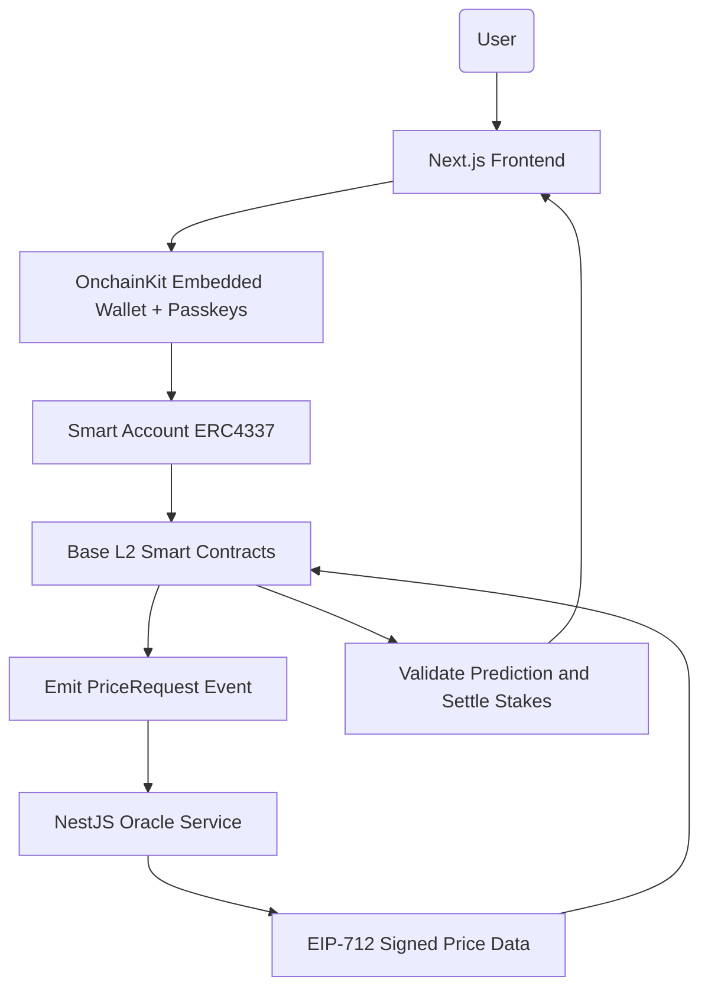
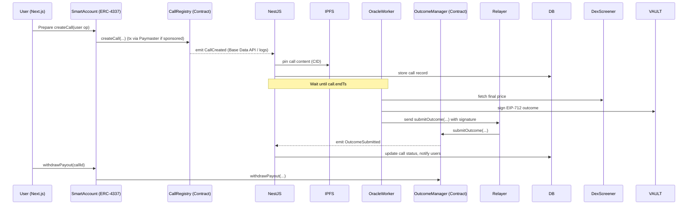
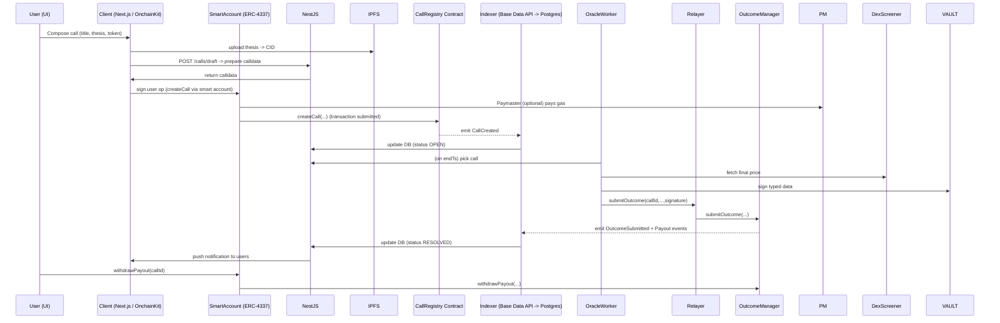

# BackIT (Onchain) - Multi-Chain Architecture (Base + Stellar)

**Complete system design & architecture (fool-proof, opinionated, ready-to-ship)**  

## Stack Overview

### Base (EVM) Stack
- **Frontend:** Next.js (App Router) + **OnchainKit** (provider + UI)  
- **Wallet / Auth:** ERC-4337 Smart Accounts (AA), Passkeys / Embedded wallets, OnchainKit provider (no SIWE)  
- **Contracts:** Solidity, develop with **Foundry** (forge, cast, anvil)  
- **Oracle model:** Off-chain EIP-712 signer (secp256k1)  
- **Gas sponsorship:** Base Paymaster (ERC-4337) for mainnet onboarding

### Stellar (Soroban) Stack
- **Frontend:** Next.js (App Router) + **@stellar/freighter-api** (wallet)  
- **Wallet / Auth:** Freighter, Lobstr, Albedo (native Stellar wallets)  
- **Contracts:** Rust, develop with **Soroban SDK** (soroban-cli)  
- **Oracle model:** Off-chain ed25519 signer  
- **Fees:** Stellar resource fees (very low)

### Shared Infrastructure
- **Backend:** NestJS (Oracle worker, relayer, multi-chain indexer)  
- **DB:** PostgreSQL + Redis + BullMQ  
- **Price sources:** DexScreener (primary) + GeckoTerminal (fallback)  
- **Storage:** IPFS for call metadata


---

## Table of contents

1. Goals & invariants  
2. High-level architecture diagrams  
3. Component responsibilities (detailed)  
4. On-chain design — Base (Solidity contracts, events, interfaces)  
5. On-chain design — Stellar (Soroban contracts, events, interfaces)  
6. Oracle & outcome verification (multi-chain: EIP-712 + ed25519)  
7. Off-chain backend (NestJS) — services, DB, multi-chain indexer & relayer  
8. Frontend — Multi-chain wallet integration (OnchainKit + Freighter)  
9. Indexing — Base (ethers.js) + Stellar (Horizon/SorobanRPC)  
10. Storage & content immutability (IPFS)  
11. Security, reliability & audit checklist  
12. Failure modes & mitigations  
13. Deployments, dev tools & CI/CD (Foundry + Soroban)  
14. MVP roadmap & timelines  
15. Appendices: DB schema, API list, contract snippets, sequence diagrams


---

# 1 — Goals & invariants

- **Calls are immutable prediction objects**: token, condition, stake, startTs, endTs, contentCID (IPFS). On-chain stores minimal metadata only.  
- **Support for any token (including memecoins)**: DexScreener coverage is required. Pyth or on-chain oracles are optional later but not sufficient for memes.  
- **Stakes**: Prefer ERC-20 stablecoin (USDC) for predictable payouts. Native ETH or other ERC-20 possible. Stakes are escrowed on-chain.  
- **Outcome model**: Backend fetches price data at deadline, constructs an EIP-712 typed message, signs, and submits `submitOutcome` to contract (or returns signature to relayer). Contract verifies signer and settles.  
- **User experience**: Leverage ERC-4337 smart accounts and Base Paymaster to allow gasless onboarding. Use OnchainKit provider for UI integration.  
- **Simplicity & scalability**: Keep on-chain logic minimal, index events off-chain, design oracle pipeline to scale from single signer → multisig → multiple signers.  
- **Security**: Oracle keys stored in KMS/Vault; use multisig (Gnosis Safe) for admin actions in production.

---

# 2 — High-level architecture diagrams

## 2.1 System flow (overview)



## 2.2 Sequence: Create → Resolve → Payout



---

# 3 — Component responsibilities (detailed)

## 3.1 Frontend (Next.js + OnchainKit)
- **Wallet / Auth**: OnchainKit manages smart account creation & user ops; passkeys and embedded wallets supported.  
- **Token discovery**: Proxy calls to backend `/tokens/search` which queries DexScreener and caches results.  
- **Create Call UI**: Title, thesis, token selector, condition builder (Target/Percent/Range), stake selector (USDC default). Upload thesis to IPFS.  
- **Transaction flow**: Compose user op, sign via smart account, submit via OnchainKit. If user opts-in, Paymaster sponsors gas.  
- **Feeds & Threads**: Pull from Postgres via NestJS endpoints; live updates via WebSocket.  
- **Outcome provenance**: Show final price, signer address, EIP-712 signature data and link to evidence (API response pinned to IPFS if required).

## 3.2 Off-chain Backend (NestJS)
- **Auth**: Manage smart-account sessions; map smart account → user profile; no SIWE.  
- **TokenDiscovery**: Normalize token metadata, compute liquidity & safety score.  
- **IndexerService**: Use Base Data API (or WebSocket + RPC) to consume events and update Postgres.  
- **OracleWorker**: Identify due calls, fetch prices, sign outcomes via KMS, submit signed outcome via relayer.  
- **RelayerService**: Submit on-chain txs (submitOutcome) and optionally meta-tx for users. Interact with Paymaster for gas sponsorship.  
- **PinService**: Upload & pin call content and optionally API evidence to IPFS.  
- **NotificationService**: WebSocket server for live feed pushes.  
- **Admin/Moderation**: Flag, review, and manage dispute workflows.

## 3.3 On-chain (Contracts)
- **CallRegistry**: Minimal storage of call records and stakes; emits `CallCreated`.  
- **OutcomeManager**: Verifies EIP-712 signatures and settles outcomes; supports `withdrawPayout`.  
- **Paymaster**: ERC-4337 Paymaster contract for sponsorship.  
- **Treasury/FeeVault**: Collects platform fees for operations.

## 3.4 Indexing & Storage
- **Base Data API**: Used to read events and transaction history quickly.  
- **TheGraph (optional)**: For complex GraphQL queries / analytics if needed.  
- **Postgres**: Main read model for the UI and feeds; use `tsvector` for full text.  
- **IPFS**: Store long texts, avatars, comments. Pin via Pinata or self-hosted cluster.

---

# 4 — On-chain design — Base (Solidity contracts, events, interfaces)

## 4.1 Contracts & responsibilities
- **CallRegistry** (factory/registry):
  - `createCall(...)` — registers call metadata + escrow stake
  - `stakeOnCall(callId, amount)` — other participants can join
  - emits `CallCreated`

- **OutcomeManager**:
  - `submitOutcome(callId, outcome, finalPrice, timestamp, signature)`
  - verifies EIP-712 signature
  - marks `settled` and emits `OutcomeSubmitted`
  - payout via `withdrawPayout(callId)`

- **Paymaster (ERC-4337)**:
  - sponsor user ops (with policy & allowance checks)
  - interacts with relayer infrastructure

- **Treasury**:
  - collect fees, admin withdraw (multisig)

## 4.2 Structs & Events

### Call struct (on-chain minimal)
```solidity
struct Call {
  address creator;
  address stakeToken;
  uint256 totalStake;
  uint256 startTs;
  uint256 endTs;
  address tokenAddress;
  bytes32 pairId;
  string ipfsCID;
  bool settled;
  bool outcome;
  uint256 finalPrice;
}
```

### Events
- `CallCreated(uint256 indexed callId, address indexed creator, address stakeToken, uint256 stakeAmount, uint256 startTs, uint256 endTs, address tokenAddress, bytes32 pairId, string ipfsCID)`
- `StakeAdded(uint256 indexed callId, address indexed staker, uint256 amount)`
- `OutcomeSubmitted(uint256 indexed callId, bool outcome, uint256 finalPrice, address oracle)`
- `PayoutWithdrawn(uint256 indexed callId, address indexed recipient, uint256 amount)`

## 4.3 Gas & safety rules
- Avoid unbounded loops; per-participant accounting & pull payouts.
- Store only necessary fields on-chain; full content lives on IPFS.
- Use `immutable` for domain constants (e.g., EIP-712 name/version).
- Reentrancy guards and SafeERC20 everywhere.

---

# 5 — On-chain design — Stellar (Soroban contracts, events, interfaces)

Stellar uses **Soroban**, a Rust-based smart contract platform. The contracts mirror the Base functionality but use Stellar-native patterns.

## 5.1 Contracts & responsibilities

- **call_registry** (factory/registry):
  - `create_call(...)` — registers call metadata + escrow stake
  - `stake_on_call(call_id, amount, position)` — other participants can join
  - emits `CallCreated` event via `env.events().publish()`

- **outcome_manager**:
  - `submit_outcome(call_id, outcome, final_price, timestamp, signature)`
  - verifies ed25519 signature via `env.crypto().ed25519_verify()`
  - marks `settled` and emits `OutcomeSubmitted`
  - payout via `withdraw_payout(call_id)`

## 5.2 Soroban Contract Structure

```rust
// packages/contracts-stellar/call_registry/src/lib.rs
#![no_std]
use soroban_sdk::{
    contract, contractimpl, contracttype, symbol_short,
    Address, BytesN, Env, Map, String, Symbol, Vec,
    token::Client as TokenClient,
};

#[contracttype]
pub struct Call {
    pub creator: Address,
    pub stake_token: Address,
    pub total_stake_yes: i128,
    pub total_stake_no: i128,
    pub start_ts: u64,
    pub end_ts: u64,
    pub token_address: Address,
    pub pair_id: BytesN<32>,
    pub ipfs_cid: String,
    pub settled: bool,
    pub outcome: bool,
    pub final_price: i128,
}

#[contracttype]
pub enum DataKey {
    Call(u64),
    NextCallId,
    UserStake(u64, Address, bool), // (call_id, user, position)
}

#[contract]
pub struct CallRegistry;

#[contractimpl]
impl CallRegistry {
    pub fn create_call(
        env: Env,
        creator: Address,
        stake_token: Address,
        stake_amount: i128,
        end_ts: u64,
        token_address: Address,
        pair_id: BytesN<32>,
        ipfs_cid: String,
    ) -> u64 {
        creator.require_auth();
        
        // Transfer stake to contract
        let token = TokenClient::new(&env, &stake_token);
        token.transfer(&creator, &env.current_contract_address(), &stake_amount);
        
        // Get next call ID
        let call_id: u64 = env.storage().instance()
            .get(&DataKey::NextCallId)
            .unwrap_or(0);
        
        // Create call
        let call = Call {
            creator: creator.clone(),
            stake_token,
            total_stake_yes: stake_amount,
            total_stake_no: 0,
            start_ts: env.ledger().timestamp(),
            end_ts,
            token_address,
            pair_id,
            ipfs_cid,
            settled: false,
            outcome: false,
            final_price: 0,
        };
        
        env.storage().persistent().set(&DataKey::Call(call_id), &call);
        env.storage().instance().set(&DataKey::NextCallId, &(call_id + 1));
        
        // Store user stake
        env.storage().persistent().set(
            &DataKey::UserStake(call_id, creator.clone(), true),
            &stake_amount
        );
        
        // Emit event
        env.events().publish(
            (symbol_short!("CallCrtd"), call_id),
            (creator, stake_amount, end_ts)
        );
        
        call_id
    }
    
    pub fn stake_on_call(
        env: Env,
        staker: Address,
        call_id: u64,
        amount: i128,
        position: bool, // true = YES, false = NO
    ) {
        staker.require_auth();
        
        let mut call: Call = env.storage().persistent()
            .get(&DataKey::Call(call_id))
            .expect("Call not found");
        
        assert!(env.ledger().timestamp() < call.end_ts, "Call ended");
        assert!(!call.settled, "Call settled");
        
        // Transfer stake
        let token = TokenClient::new(&env, &call.stake_token);
        token.transfer(&staker, &env.current_contract_address(), &amount);
        
        // Update totals
        if position {
            call.total_stake_yes += amount;
        } else {
            call.total_stake_no += amount;
        }
        
        env.storage().persistent().set(&DataKey::Call(call_id), &call);
        
        // Emit event
        env.events().publish(
            (symbol_short!("StakeAdd"), call_id),
            (staker, position, amount)
        );
    }
}
```

## 5.3 Outcome Manager (Soroban)

```rust
// packages/contracts-stellar/outcome_manager/src/lib.rs
#![no_std]
use soroban_sdk::{
    contract, contractimpl, contracttype,
    Address, BytesN, Env, Symbol, symbol_short,
};

#[contracttype]
pub enum DataKey {
    AuthorizedOracle(Address),
    Settled(u64),
    CallRegistry,
}

#[contract]
pub struct OutcomeManager;

#[contractimpl]
impl OutcomeManager {
    pub fn submit_outcome(
        env: Env,
        call_id: u64,
        outcome: bool,
        final_price: i128,
        timestamp: u64,
        public_key: BytesN<32>,
        signature: BytesN<64>,
    ) {
        // Check not already settled
        let settled: bool = env.storage().persistent()
            .get(&DataKey::Settled(call_id))
            .unwrap_or(false);
        assert!(!settled, "Already settled");
        
        // Verify oracle is authorized
        let oracle_addr = Address::from_contract_id(&public_key);
        let is_authorized: bool = env.storage().instance()
            .get(&DataKey::AuthorizedOracle(oracle_addr.clone()))
            .unwrap_or(false);
        assert!(is_authorized, "Unauthorized oracle");
        
        // Construct message to verify
        let message = Self::build_outcome_message(&env, call_id, outcome, final_price, timestamp);
        
        // Verify ed25519 signature
        env.crypto().ed25519_verify(&public_key, &message, &signature);
        
        // Mark settled
        env.storage().persistent().set(&DataKey::Settled(call_id), &true);
        
        // Emit event
        env.events().publish(
            (symbol_short!("Outcome"), call_id),
            (outcome, final_price, oracle_addr)
        );
    }
    
    fn build_outcome_message(
        env: &Env,
        call_id: u64,
        outcome: bool,
        final_price: i128,
        timestamp: u64,
    ) -> BytesN<64> {
        // Construct canonical message for signing
        // Implementation details...
        todo!()
    }
}
```

## 5.4 Key Differences from Base

| Aspect | Base (Solidity) | Stellar (Soroban) |
|--------|-----------------|-------------------|
| **Language** | Solidity | Rust |
| **Addresses** | `0x...` (20 bytes) | `G...` or `C...` (56 chars) |
| **Tokens** | ERC-20 contracts | Stellar Asset / SAC |
| **Signatures** | secp256k1 + EIP-712 | ed25519 |
| **Storage** | State variables | `env.storage()` (instance/persistent/temporary) |
| **Events** | `emit Event(...)` | `env.events().publish(...)` |
| **Auth** | `msg.sender` | `address.require_auth()` |
| **Gas** | ETH gas model | Stellar resource fees |

## 5.5 USDC on Stellar

Stellar has **native Circle USDC** (not a smart contract):
- Issuer: `GA5ZSEJYB37JRC5AVCIA5MOP4RHTM335X2KGX3IHOJAPP5RE34K4KZVN`
- Asset Code: `USDC`
- Can be wrapped as Stellar Asset Contract (SAC) for Soroban use

---

# 6 — Oracle & outcome verification (multi-chain: EIP-712 + ed25519)

The oracle service supports both Base and Stellar with different signature schemes.

## 6.1 Signing Overview

| Chain | Signature Scheme | Key Type | Verification Method |
|-------|------------------|----------|---------------------|
| Base | EIP-712 typed data | secp256k1 | `ECDSA.recover` in Solidity |
| Stellar | Raw message hash | ed25519 | `env.crypto().ed25519_verify()` in Soroban |

## 6.2 Base: EIP-712 Flow

### Why EIP-712 & Off-chain signer?
- EIP-712 provides typed structured data; on-chain verification is straightforward.
- Supports any off-chain price source (DexScreener), giving coverage for memecoins.
- Scales: single signer → add multiple signers or multisig later.

### Domain / Types / Message (exact)

**Domain**
```json
{
  "name": "OnChainSageOutcome",
  "version": "1",
  "chainId": 8453,
  "verifyingContract": "0xOutcomeManagerAddress"
}
```

**Types**
```json
{
  "Outcome": [
    { "name": "callId", "type": "uint256" },
    { "name": "outcome", "type": "bool" },
    { "name": "finalPrice", "type": "uint256" },
    { "name": "timestamp", "type": "uint256" }
  ]
}
```

**Message example**
```json
{
  "callId": 42,
  "outcome": true,
  "finalPrice": "1234567890000000000",
  "timestamp": 1748123122
}
```

### On-chain verification logic (OutcomeManager.sol)
- Recreate digest via `_hashTypedDataV4(keccak256(...))`.
- Recover signer via `ECDSA.recover`.
- Check `authorizedOracle[signer]` mapping.
- Ensure `!settled[callId]` and `block.timestamp >= calls[callId].endTs`.
- Mark settled, store `finalPrice`, set `outcome`, emit `OutcomeSubmitted`.

## 6.3 Stellar: ed25519 Flow

### Why ed25519?
- Native to Stellar ecosystem (all Stellar keys are ed25519).
- Fast and secure; no additional libraries needed.
- Direct verification via `env.crypto().ed25519_verify()`.

### Message Format

```typescript
// Oracle constructs this message
const message = Buffer.concat([
  Buffer.from('BackIt:Outcome:'),
  Buffer.from(callId.toString()),
  Buffer.from(':'),
  Buffer.from(outcome ? '1' : '0'),
  Buffer.from(':'),
  Buffer.from(finalPrice.toString()),
  Buffer.from(':'),
  Buffer.from(timestamp.toString()),
]);

// Sign with ed25519 private key
const signature = nacl.sign.detached(message, privateKey);
```

### Soroban Verification

```rust
// In outcome_manager contract
let message = Self::build_outcome_message(&env, call_id, outcome, final_price, timestamp);
env.crypto().ed25519_verify(&public_key, &message, &signature);
```

## 6.4 Backend Signing & Submission Flow (Multi-Chain)

```typescript
// oracle.service.ts
async signOutcome(callId: number, outcome: boolean, finalPrice: bigint, chain: 'base' | 'stellar') {
  if (chain === 'base') {
    return this.signEIP712(callId, outcome, finalPrice);
  } else {
    return this.signEd25519(callId, outcome, finalPrice);
  }
}

private async signEIP712(callId: number, outcome: boolean, finalPrice: bigint) {
  // Use ethers.js Wallet.signTypedData
  const domain = { name: 'OnChainSageOutcome', version: '1', chainId: 8453, ... };
  return this.signer.signTypedData(domain, types, { callId, outcome, finalPrice, timestamp });
}

private async signEd25519(callId: number, outcome: boolean, finalPrice: bigint) {
  // Use tweetnacl or @stellar/stellar-sdk
  const message = this.buildStellarMessage(callId, outcome, finalPrice);
  return nacl.sign.detached(message, this.stellarPrivateKey);
}
```

---

# 7 — Off-chain backend (NestJS) — multi-chain indexer & relayer

## 7.1 Core modules
- **AuthModule**: Smart account sessions, passkeys, embedded wallets.  
- **CallsModule**: create drafts, IPFS pinning, calldata generation.  
- **OracleModule**: price fetcher, signing, submission.  
- **IndexerModule**: Base Data API consumer + Postgres writes.  
- **RelayerModule**: submit transactions & handle paymaster policies.  
- **NotificationModule**: WebSocket push (socket.io) to clients.  
- **AdminModule**: moderation, dispute handling.

## 7.2 Database schema (core tables)
See Appendix A for full DDL. Key columns:
- `calls.condition_json` holds condition type (target/pct/range) and parameters.
- `participants.side` indicates which side the participant backed (UP/DOWN).

## 7.3 Oracle worker behavior (multi-chain pseudocode)
```ts
while(true):
  calls = db.query("SELECT ... WHERE end_ts <= now AND status = 'OPEN' FOR UPDATE SKIP LOCKED")
  for call in calls:
    pair = fetchDexScreener(call.pairId)
    if not pair: pair = fetchGecko(call.tokenAddress)
    if not pair:
      db.update(call.id, {status: 'UNRESOLVED'})
      notifyAdmins(call)
      continue
    finalPrice = floor(pair.priceUsd * 1e18)
    outcome = evaluateCondition(call.condition_json, finalPrice)
    evidenceCid = pinToIPFS({pair, callSnapshot})
    signature = kms.signEIP712({callId:call.id, outcome, finalPrice, timestamp: now})
    txHash = relayer.submitOutcome(call.id, outcome, finalPrice, now, signature)
    db.update(call.id, {status: 'SETTLING', finalPrice, oracle_signature: signature, evidence_cid: evidenceCid})
```

## 7.4 Relayer & Paymaster (Base) / Direct Submission (Stellar)
- Relayer submits `submitOutcome` transactions to OutcomeManager contract.
- For user flows, Paymaster can sponsor gas for user ops; relayer interacts with Paymaster policy to approve sponsored user ops.
- Monitor relayer spend, limit per address, and rate-limit to prevent abuse.

---

# 8 — Frontend — Multi-chain wallet integration (OnchainKit + Freighter)

## 8.1 Onboarding (Base)
- Offer **passkeys** and **embedded wallet** as first option (web2-like).
- Offer advanced users MetaMask or other wallets.
- On first use, create an ERC-4337 Smart Account (via OnchainKit), with optional Paymaster sponsorship to fund the account.

## 8.2 Onboarding (Stellar)
- Offer **Freighter** wallet as primary option.
- Fallback: Lobstr, Albedo, xBull wallets.
- No smart accounts; users connect their standard Stellar keypair.
- Use `@stellar/freighter-api` for wallet connection.

## 8.3 Create Call (detailed UI steps)
1. Token search: `GET /tokens/search?q=` — shows token, liquidity, 24h volume, pair age.
2. Compose: Title + thesis editor (rich text) → save (auto-upload to IPFS).
3. Condition builder: pick `TargetPrice`, `PercentMove`, or `Range`. UI computes instant preview.
4. Stake: choose amount and token (default USDC). If using ERC-20, UI triggers `approve` flow or integrates with smart account allowance.
5. Confirm: call `POST /calls/tx` → returns calldata and gas estimate.
6. Smart account signs user op via OnchainKit UI; if user enabled, Paymaster pays gas.
7. Show pending tx & optimistic UI entry until indexed.

## 8.4 Chain Selector
- User picks chain (Base or Stellar) at the top of the UI.
- Wallet connection auto-adapts based on selected chain.
- Feed shows calls from both chains with chain badge indicator.

## 8.5 Viewing / Interaction
- Timeline: combined social + call feed (follow graph + trending).  
- Call Detail: shows thesis, participants, live pool, comments, oracle evidence once resolved.  
- Withdraw: users call `withdrawPayout` via smart account; UI shows claimable amount.

---

# 9 — Indexing — Base (ethers.js) + Stellar (Horizon/SorobanRPC)

## 9.1 Base: RPC & Provider strategy
- Use Alchemy or Ankr Base RPCs with primary & fallback endpoints.
- Store keys in env & rotate as needed; throttle calls.

## 9.2 Base: Data API
- Preferred for fast indexed reads and event history.  
- Use for feed hydration and user-centric queries (calls by user, user stake history).

## 9.3 Stellar: Horizon & SorobanRPC
- Use **Stellar Horizon API** for account/transaction queries.
- Use **SorobanRPC** for contract event subscriptions.
- Subscribe to contract events via `getEvents` RPC method.

## 9.4 Indexer design (Multi-Chain)
- **Base**: Use ethers.js event listeners or Data API webhooks to capture `CallCreated`, `StakeAdded`, `OutcomeSubmitted`, `PayoutWithdrawn`.
- **Stellar**: Poll SorobanRPC `getEvents` for contract events.
- Upsert into Postgres with `chain` column; update `tsvector` for search.

## 9.5 Real-time
- NestJS pushes updates via Socket.io to connected clients for live feed & notifications.

---

# 10 — Storage & content immutability (IPFS)

- **IPFS**: pin all textual content. Save CID on-chain at call creation.  
- **Evidence pinning**: when oracle fetches price, pin JSON with the API response + timestamp to IPFS and save `evidence_cid` to DB (not necessarily on-chain) for audits.  
- **Pinning strategy**: Pinata (fast) for MVP; transition to self-hosted IPFS cluster for high availability. Optionally move important winners to Arweave for permanent storage.

---

# 11 — Security, reliability & audit checklist

## 11.1 Base Contracts (Solidity)
- Use Foundry for testing (unit, integration, fuzzing).  
- Use OZ libraries: SafeERC20, ReentrancyGuard.  
- Implement `circuitBreaker` and `onlyOwner` with multisig admin.  
- Validate all inputs; protect against reentrancy and unexpected ERC20 behaviors.

## 11.2 Stellar Contracts (Soroban)
- Use `soroban contract build` and `soroban contract test` for testing.
- Use Soroban SDK test utilities for unit tests.
- Validate all inputs; use proper error handling with `panic!` or `Result`.

## 11.3 Keys & Oracles
- Oracle keys in KMS/Vault (do not export private keys).  
- Implement rotation & emergency replacement via multisig.  
- Log all signed messages and API evidence.

## 11.4 Backend
- Rate limit endpoints & proxy.  
- Use request validation and schema checks for DexScreener responses.  
- Keep audit logs immutable where possible.

## 11.5 Paymaster (Base only)
- Restrict paymaster budgets and per-account spend.  
- Monitor abuse and enforce per-address caps.

---

# 12 — Failure modes & mitigations (practical list)

1. **Price API outage** → fallback to GeckoTerminal, else mark UNRESOLVED and escalate. Pin evidence for audits.  
2. **Oracle signer compromise** → pause via `circuitBreaker`; replace signer via multisig; audit signed messages.  
3. **Liquidity manipulation** → enforce liquidity thresholds or show warnings; disallow pair if below threshold.  
4. **DOS / spam** → minimal stake requirement; rate limits and captchas for new accounts.  
5. **Paymaster depletion** → monitor spend & auto-disable sponsorship when budget exhausted.

---

# 13 — Deployments, dev tools & CI/CD (Foundry + Soroban)

## 13.1 Base: Foundry (primary for Solidity contracts)
- Local node: `anvil`  
- Test: `forge test -vv`  
- Script deploy: `forge script script/Deploy.s.sol --rpc-url $BASE_SEPOLIA_RPC --broadcast`  
- Use `forge verify-contract` or Hardhat's verify plugin for BaseScan verification.

## 13.2 Stellar: Soroban CLI
- Build: `soroban contract build`
- Test: `soroban contract test`
- Deploy: `soroban contract deploy --wasm target/wasm32-unknown-unknown/release/contract.wasm --network testnet`
- Verify on Stellar Expert or StellarChain explorer.

## 13.3 Backend & Frontend
- NestJS & Next.js in Docker. CI runs tests, lint, and builds.  
- Deploy Next.js to Vercel; NestJS to AWS ECS / GCP Cloud Run / Fly.io.  
- Use GitHub Actions for pipeline: run `forge test` -> lint -> build -> deploy.

---

# 14 — MVP roadmap & timelines

**Sprint 0 (1 week)** — scaffolding  
- Foundry skeleton + basic contract interfaces + simple tests  
- Next.js + OnchainKit onboarding demo  
- NestJS skeleton + Postgres

**Sprint 1 (2–3 weeks)** — core create & feed flows  
- Implement CallRegistry + OutcomeManager (Foundry)  
- Create Call UI (IPFS) + createCall on-chain (smart accounts)  
- Indexer using Base Data API → Postgres feed

**Sprint 2 (2 weeks)** — oracle automation & payout flows  
- OracleWorker: DexScreener integration + EIP-712 signing using KMS  
- Relayer: submitOutcome tx + SETTLING/RESOLVED lifecycle  
- Withdraw flow & notifications

**Sprint 3 (2 weeks)** — polish & production readiness  
- Base Paymaster integration for gas sponsorship  
- Liquidity checks, honeypot detectors, moderation UI  
- Tests, Foundry fuzzing, prepare audit & multisig migration

**Sprint 4 (2-3 weeks)** — Stellar integration  
- Soroban contract development (call_registry, outcome_manager)  
- Stellar wallet integration (Freighter)  
- Multi-chain indexer (SorobanRPC)  
- ed25519 oracle signing  
- Chain selector UI

---

# 15 — Appendices

## Appendix A — Postgres schema (DDL simplified)

```sql
CREATE TABLE users (
  wallet VARCHAR PRIMARY KEY,
  smart_account VARCHAR,
  display_name TEXT,
  avatar_cid TEXT,
  created_at timestamptz DEFAULT now()
);

CREATE TABLE calls (
  id SERIAL PRIMARY KEY,
  call_onchain_id BIGINT NULL,
  creator_wallet VARCHAR REFERENCES users(wallet),
  ipfs_cid TEXT,
  token_address VARCHAR,
  pair_id TEXT,
  stake_token VARCHAR,
  stake_amount NUMERIC,
  start_ts timestamptz,
  end_ts timestamptz,
  condition_json JSONB,
  status VARCHAR, -- OPEN, SETTLING, RESOLVED, UNRESOLVED
  outcome BOOLEAN,
  final_price NUMERIC,
  oracle_signature TEXT,
  evidence_cid TEXT,
  created_at timestamptz DEFAULT now(),
  updated_at timestamptz DEFAULT now()
);

CREATE TABLE participants (
  id SERIAL PRIMARY KEY,
  call_id INT REFERENCES calls(id),
  wallet VARCHAR,
  stake_amount NUMERIC,
  side VARCHAR,
  created_at timestamptz DEFAULT now()
);
```

## Appendix B — EIP-712 typed data (JSON example)

```json
{
  "domain": {
    "name": "OnChainSageOutcome",
    "version": "1",
    "chainId": 8453,
    "verifyingContract": "0xOutcomeManagerAddress"
  },
  "types": {
    "Outcome": [
      { "name": "callId", "type": "uint256" },
      { "name": "outcome", "type": "bool" },
      { "name": "finalPrice", "type": "uint256" },
      { "name": "timestamp", "type": "uint256" }
    ]
  },
  "primaryType": "Outcome",
  "message": {
    "callId": 42,
    "outcome": true,
    "finalPrice": "1234567890000000000",
    "timestamp": 1748123122
  }
}
```

## Appendix C — Foundry contract layout & sample snippet

```
/src
  CallRegistry.sol
  OutcomeManager.sol
  Paymaster.sol
/test
  CallRegistry.t.sol
  OutcomeManager.t.sol
/script
  Deploy.s.sol
```

### OutcomeManager snippet

```solidity
// SPDX-License-Identifier: MIT
pragma solidity ^0.8.19;
import "@openzeppelin/contracts/utils/cryptography/draft-EIP712.sol";
import "@openzeppelin/contracts/utils/cryptography/ECDSA.sol";

contract OutcomeManager is EIP712 {
  bytes32 public constant OUTCOME_TYPEHASH = keccak256("Outcome(uint256 callId,bool outcome,uint256 finalPrice,uint256 timestamp)");
  mapping(address => bool) public authorizedOracle;
  mapping(uint256 => bool) public settled;

  constructor() EIP712("OnChainSageOutcome", "1") {}

  function submitOutcome(
    uint256 callId,
    bool outcome,
    uint256 finalPrice,
    uint256 timestamp,
    bytes calldata signature
  ) external {
    require(!settled[callId], "Already settled");
    // verify call end time from CallRegistry (off-chain or via call)
    bytes32 structHash = keccak256(abi.encode(OUTCOME_TYPEHASH, callId, outcome, finalPrice, timestamp));
    bytes32 digest = _hashTypedDataV4(structHash);
    address signer = ECDSA.recover(digest, signature);
    require(authorizedOracle[signer], "Invalid oracle");
    settled[callId] = true;
    // TODO: store finalPrice, emit OutcomeSubmitted and enable withdrawals
  }
}
```

## Appendix D — Sequence diagrams (create → resolve → payout)



---

# Closing notes

This markdown file is a comprehensive, Base-aligned system design tailored to your "OnChain Sage — Forum / Calls" app. It includes Foundry-centered smart contract practices, OnchainKit-based frontend integration, ERC-4337 smart accounts, EIP-712 oracle flows, Base Data API indexing, Paymaster sponsorship, and operational guidance.

If you'd like, I can:
- produce the **Solidity Foundry contract** (CallRegistry + OutcomeManager + tests) next, or  
- scaffold the **NestJS Oracle Worker** with KMS signing and DexScreener integration, or  
- generate **Next.js pages** with OnchainKit integration for create-call + wallet onboarding.

Tell me which artifact to produce next or if you want any edits to this file.
